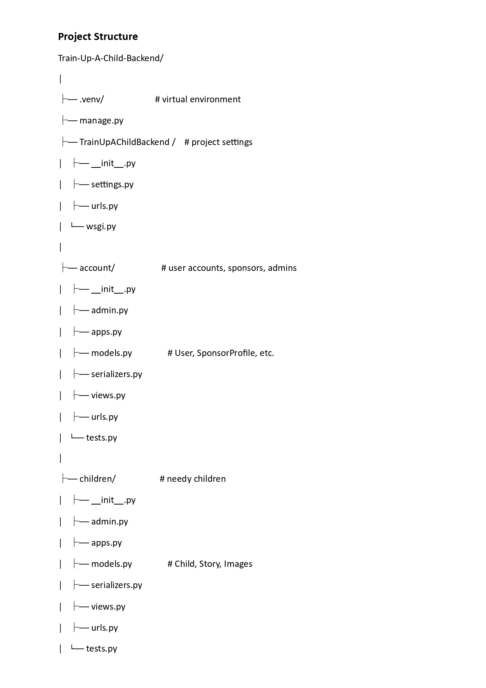
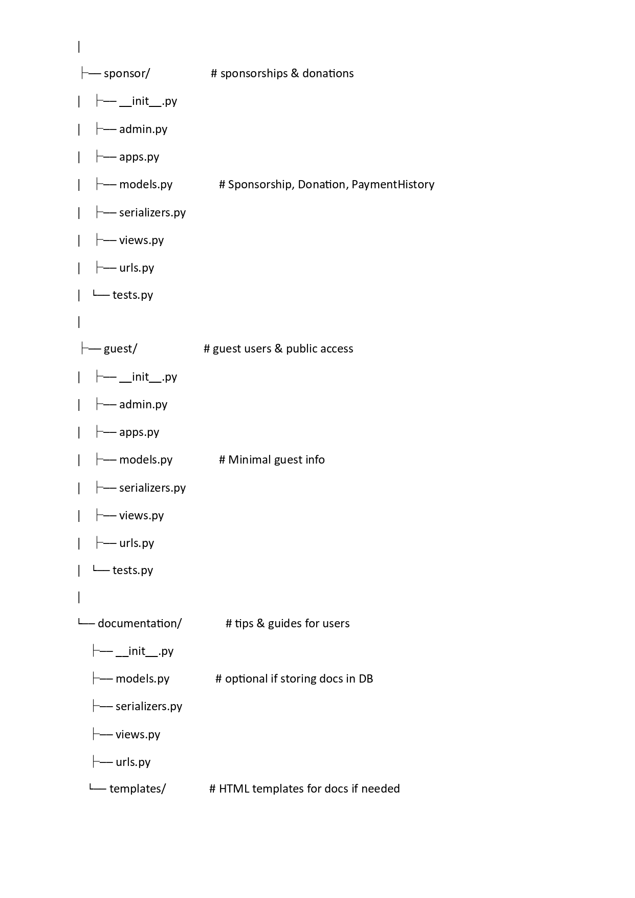
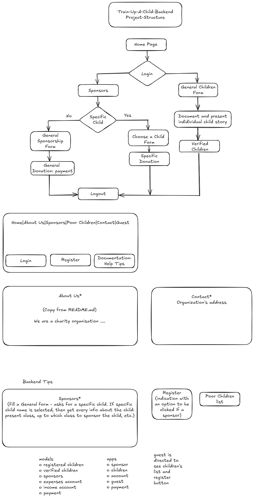

README Contents:

+ Project Description

+ Project Structure 

+ Features

+ Technologies

+ Folder Structure

+ General README for all my projects

+ Getting Started (Setup Instructions)

+ Future Improvements


# Train-Up-A-Child 🎓

> A Next.js-based platform to connect sponsors with needy kids for educational support and general upkeep in remote areas.


---

## 🌟 Project Description

**Train-Up-A-Child** is a compassionate sponsorship platform designed to create life-changing connections between generous sponsors and children in need. The application empowers users to:

- 📋 Register Needy Children – Document and present individual stories.
- 🧑‍🤝‍🧑 Sign Up as a Sponsor – Become part of a supportive network.
- 🎓 Sponsor a specific Child’s Education – Enable academic journeys through targeted sponsorship.
- 💖 Donate for General Welfare – Contribute to the holistic wellbeing of all children on the platform.
---
## Project Structure 


---

## Project Flow
### Backend and Frontend
(as intended)


---

## 🚀 Features

- 🏠 **Home** – Project introduction and mission statement
- 👨‍👩‍👧‍👦 **About Us** – Vision, team, and goals
- 💰 **Sponsors** – Register as a sponsor or view other sponsors
- 👶 **Needy Children** – View profiles of children needing help
- 📞 **Contact** – Reach out for inquiries or feedback
- 🔗 **Navbar Component** – Seamless navigation across pages

---

## 🛠️ Tech Stack

- **Frontend**: Built with Next.js (https://nextjs.org/) (App Router), prioritizing accessibility, user-friendliness, and clean design.
- **Language & Framework Language:** JavaScript Framework: React (as used inside Next.js)
- **Styling**: CSS (can extend with Tailwind or Sass)
- **Database**: PostgreSQL Database
- **Hosting**: Vercel or any cloud platform
- **Backend Integration**: Consumes a PostgreSQL database served by a robust ``Django`` backend

---
✅ Language & Framework
Language: JavaScript 
Framework: React (as used inside Next.js)
Meta-framework: Next.js with the App Router (which uses React under the hood)

✅ Styling
Base: CSS Modules (default in Next.js)

Optional Extensions:

Tailwind CSS: Utility-first, fast prototyping

Sass/SCSS: More structured and nested styling
>SASS stands for Syntactically Awesome Style Sheets. SCSS stands for Sassy CSS. Type. SASS is a popular CSS preprocessor. It is a newer SASS syntax

✅ Database
Planned: PostgreSQL Database

Access via Mongoose (schema-based ODM)

Or Prisma (powerful TypeScript ORM that now supports MongoDB)

✅ Hosting
Primary Choice: Vercel (best for Next.js)

Alternative: Any cloud/VPS that supports Node.js (e.g., Render, Railway, Heroku, etc.)

This project is working in a JavaScript/React ecosystem, specifically using Next.js (App Router) which gives you hybrid rendering (SSR + SSG + ISR) and tight integration with frontend/backend logic.

---

## 📁 Folder Structure

```bash
train-up-a-child/
├── app/
│   ├── about/
│   │   └── page.js
│   ├── sponsors/
│   │   └── page.js
│   ├── kids/
│   │   └── page.js
│   ├── contact/
│   │   └── page.js
│   └── page.js          # Home page
│
├── components/
│   └── Navbar.jsx       # Navigation bar
│
├── public/
│   └── images/
│       └── README_for_all_projects.png
│
├── styles/
│   └── globals.css      # Global styles (if used)
│
├── README.md            # You're here
└── package.json
```

### General README for all my projects


🧑‍💻 Getting Started
#### 1. Clone the repository

```
git clone https://github.com/nkemdilimjulie/Train-Up-A-Child-Frontend.git
cd Train-Up-A-Child-Frontend/train-up-a-child
```
#### 2. Install dependencies
These are already installed:
+ npm install (for npm run dev)
+ npm install next-auth (for authentication)
+ npm install stripe @stripe/stripe-js (for payments)


#### 3. Run development server
```
npm run dev
```
Visit http://localhost:3000 to view in your browser.

🔮 Future Improvements

+ ✅ Sponsor authentication with PostgreSQL Database

+ ✅ Donation processing (Stripe or PayPal)

+ ✅ Child profiles from database

+ ✅ Dashboard for sponsors

+ ✅ Form validations and error handling

+ ✅ Internationalization (i18n)

🤝 Contributing

Contributions are welcome! Fork the repo, make changes, and submit a pull request.

📃 License
MIT License © 2025 – Train-Up-A-Child Initiative

#### This project is on going: next step

See: project's Overview in chatGPT or Word documents with name of file -
+ how to start the backend using PostgreSQL Database 
+ Backend: Create Stripe Session in Django - start with, pip install stripe
+ Draw the Project Structure for a guideline 
+ Open an account stripe payments for publish (frontend) and secret (backend) keys  and  at: https://dashboard.stripe.com
---
## for later use on backend README.md: to be modified later
# Train Up a Child
## This is a Charity Organisation 
```A Call for Help```

***Children in Africa needs an SOS to their Education System***
---

Everyone is asked to:
>Train up a child in the way he should go: and when he is old, he will not depart from it.

**-- Proverbs 22 verse 6
# Train Up a Child Charity Organization

##  A Short Description of the Project

As the name already indicates, this is a charity organisation that seeks <br>
for donors who shall support the education of the less-priviledged children. 

A Call for Help:

>Children in Africa needs an SOS to their educational System<br>


Everyone is asked to:

Train up a child in the way he should go: and when he is old, he will not depart from it.   ***Proverbs 22 verse 6***

# app Descriptions

+ ```success app``` 
Includes a Back to Home button.
1. when a sponsor makes a donation and the process is successful, this success page is displayed.
at the browser:
````
http://localhost:3000/success
````

2. and Displays a message with optional donation amount of 50 dollar from query parameters (?amount=50).
at the browser:
````
http://localhost:3000/success?amount=50
````

+ ```cancel app``` 
Includes a Back to Home button. (goto ``/``)
1. when a sponsor makes a donation and the process is **NOT** successful, this cancel page is displayed.
at the browser:
````
http://localhost:3000/success
````

2. and Displays a message with optional donation amount of 50 dollar from query parameters (?amount=50).
at the browser:
````
http://localhost:3000/success?amount=50
````

# Stripe Payment


## 🔗 Stripe Checkout Flow

```text
FRONTEND (Next.js)                      BACKEND (Django)                    STRIPE
-------------------                     ----------------                  --------
User clicks "Donate" button
   |
   |  POST /api/donations/create-checkout-session/   (with amount, e.g., 50)
   | -------------------------------------------------------->
   |                                                          Backend receives request
   |                                                          Creates Stripe Checkout Session:
   |                                                          session = stripe.checkout.Session.create(...)
   |                                                          Returns JSON with session.url
   |
   |  Backend responds: { "url": "https://checkout.stripe.com/..." }
   | <--------------------------------------------------------
   |
Frontend JS receives the URL
   |
   | window.location.href = data.url
   v
Stripe Checkout Page opens
   |
   | User enters card info & pays OR cancels
   v
Stripe redirects:
   /success?session_id=...  OR  /cancel
   |
   | Frontend `/success/page.js` reads session_id if needed
   | Frontend `/cancel/page.js` shows cancel message

````

## 🛠️ How It Works

1. **User clicks "Donate"**  
   - A button on the frontend calls your Django backend to create a Stripe Checkout session.  

2. **Backend creates Checkout session**  
   - Django uses the Stripe API to create a **`Session`** with donation details (amount, metadata).  
   - The backend responds with a **`url`** from Stripe.

3. **Frontend redirects to Stripe**  
   - The frontend takes **`session.url`** and redirects the user to Stripe’s secure payment page.  

4. **User completes or cancels payment**  
   - On success, Stripe redirects to your **`/success`** page.  
   - On cancel, Stripe redirects to your **`/cancel`** page.

5. **Frontend displays result**  
   - **`/success`** page confirms payment (you can show amount, donor name, etc.).  
   - **`/cancel`** page explains that payment was canceled.  

---


### 🔗 URL Overview

| URL                                           | Purpose                                      |
|----------------------------------------------|---------------------------------------------|
| `/donate`                                    | Donation page with button                   |
| `/api/donations/create-checkout-session/`    | Backend endpoint to create Stripe session   |
| `https://checkout.stripe.com/...`            | Stripe-hosted payment page                  |
| `/success?session_id=...`                    | Redirect page for successful payment        |
| `/cancel`                                    | Redirect page if user cancels payment       |


---

+ **``DonateButton``** so it calls not only the backend but also logs backend error messages clearly in the browser console.

✅

+ console.log("🔹 Backend response:", data) → lets you see the exact response in DevTools.

+ If the backend returns {"error": "...something..."}, it gets logged and shown as an alert.

+ Prevents silent failures — you’ll always know if the problem is frontend, backend, or Stripe.

✨ With this + the improved backend, you’ll now see where things break:

+ In Django logs (request.data, validation, Stripe errors).

+ In Browser console (Backend response, error messages).


