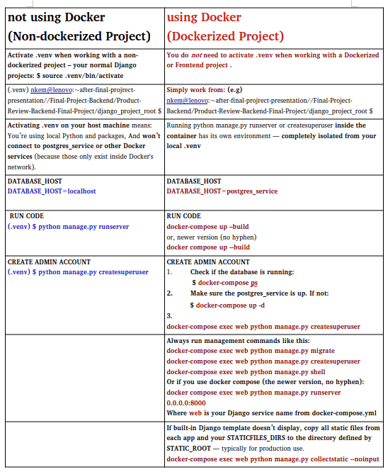

README Contents:

+ Project Description

+ Features

+ Technologies

+ Folder Structure

+ General README for all my projects

+ Getting Started (Setup Instructions)

+ Future Improvements


# Train-Up-A-Child 🎓

> A Next.js-based platform to connect sponsors with needy kids for educational support and general upkeep in remote areas.


---

## 🌟 Project Description

**Train-Up-A-Child** is a compassionate sponsorship platform that allows users to:
- Register as a sponsor
- Sponsor a specific child’s education
- Donate to support children's overall wellbeing

Built with **Next.js**, the project focuses on accessibility, simplicity, and meaningful connections between sponsors and children in need.

---

## 🚀 Features

- 🏠 **Home** – Project introduction and mission statement
- 👨‍👩‍👧‍👦 **About Us** – Vision, team, and goals
- 💰 **Sponsors** – Register as a sponsor or view other sponsors
- 👶 **Needy Kids** – View profiles of children needing help
- 📞 **Contact** – Reach out for inquiries or feedback
- 🔗 **Navbar Component** – Seamless navigation across pages

---

## 🛠️ Tech Stack

- **Frontend**: [Next.js](https://nextjs.org/) (App Router)
- **Styling**: CSS (can extend with Tailwind or Sass)
- **Database (Planned)**: MongoDB (via Mongoose or Prisma)
- **Hosting**: Vercel or any cloud platform

---
✅ Language & Framework
Language: JavaScript (or TypeScript, if preferred)

Framework: React (as used inside Next.js)

Meta-framework: Next.js with the App Router (which uses React under the hood)

✅ Styling
Base: CSS Modules (default in Next.js)

Optional Extensions:

Tailwind CSS: Utility-first, fast prototyping

Sass/SCSS: More structured and nested styling

✅ Database
Planned: MongoDB

Access via Mongoose (schema-based ODM)

Or Prisma (powerful TypeScript ORM that now supports MongoDB)

✅ Hosting
Primary Choice: Vercel (best for Next.js)

Alternative: Any cloud/VPS that supports Node.js (e.g., Render, Railway, Heroku, etc.)

This project is working in a JavaScript/React ecosystem, specifically using Next.js (App Router) which gives you hybrid rendering (SSR + SSG + ISR) and tight integration with frontend/backend logic.

---

## 📁 Folder Structure

```bash
train-up-a-child/
├── app/
│   ├── about/
│   │   └── page.js
│   ├── sponsors/
│   │   └── page.js
│   ├── kids/
│   │   └── page.js
│   ├── contact/
│   │   └── page.js
│   └── page.js          # Home page
│
├── components/
│   └── Navbar.jsx       # Navigation bar
│
├── public/
│   └── images/
│       └── README_for_all_projects.png
│
├── styles/
│   └── globals.css      # Global styles (if used)
│
├── README.md            # You're here
└── package.json
```

### General README for all my projects




🧑‍💻 Getting Started
#### 1. Clone the repository

```
git clone https://github.com/nkemdilimjulie/Train-Up-A-Child-Frontend.git
cd Train-Up-A-Child-Frontend/train-up-a-child
```
#### 2. Install dependencies

```
npm install
```
#### 3. Run development server
```
npm run dev
```
Visit http://localhost:3000 to view in your browser.

🔮 Future Improvements

+ ✅ Sponsor authentication with MongoDB

+ ✅ Donation processing (Stripe or PayPal)

+ ✅ Child profiles from database

+ ✅ Dashboard for sponsors

+ ✅ Form validations and error handling

+ ✅ Internationalization (i18n)

🤝 Contributing

Contributions are welcome! Fork the repo, make changes, and submit a pull request.

📃 License
MIT License © 2025 – Train-Up-A-Child Initiative

#### This project is on going: next step
+ how to start the backend using MongoDB 